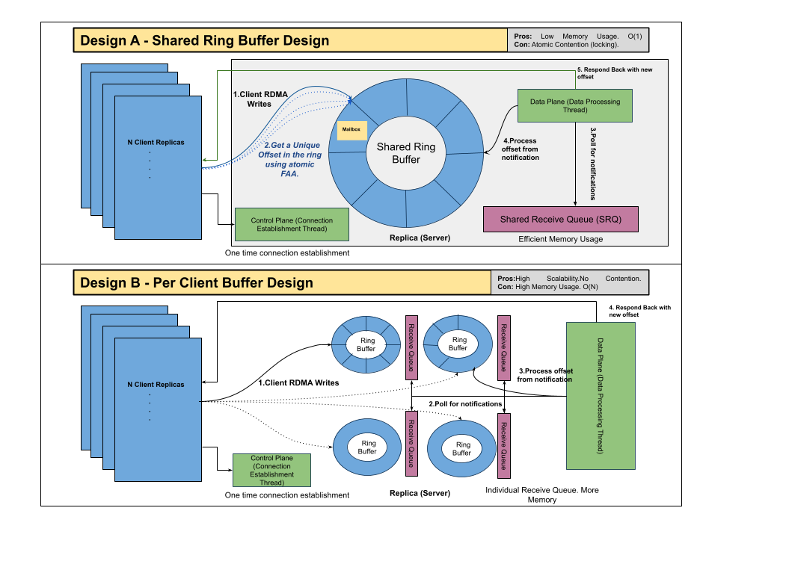
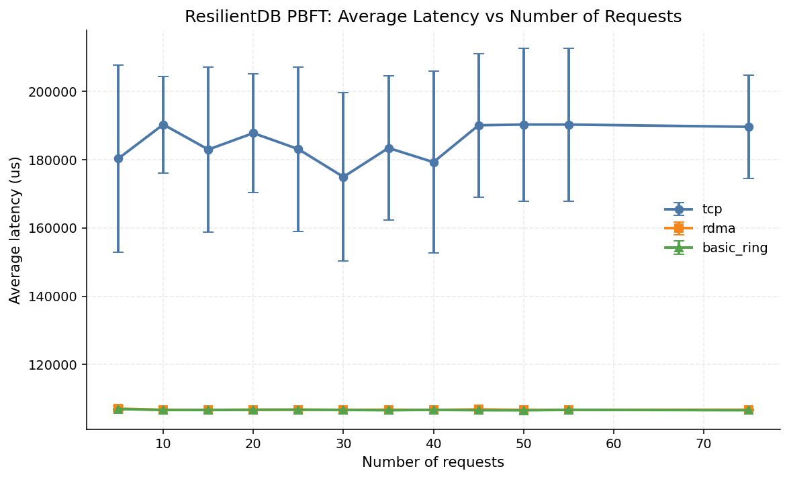
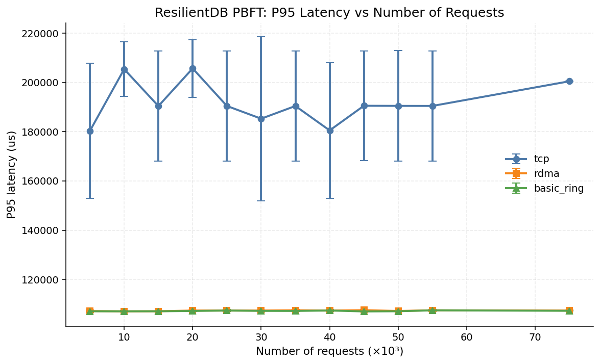
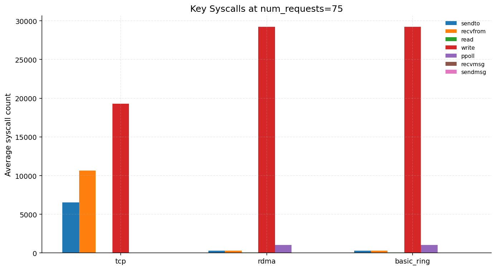

# ECS251: Accelerating Consensus in Distributed Databases using RDMA

This document summarizes the RDMA networking work completed for the consensus layer in ResilientDB.

## Implementation

We implemented an RDMA-based network strategy for the consensus layer. The implementation integrates with the platform networking abstraction and provides an RDMA transport path for replica-to-replica communication used by consensus.

- RDMA strategy source: `platform/networkstrate/rdma/`
- Network strategy interface contract: `platform/networkstrate/replica_communicator_interface.h`
- zRPC API surface that RDMA implementations expose: `platform/networkstrate/rdma/zrpc.h`

Design diagram:



## Interface and API Notes

The consensus layer communicates through the `IReplicaCommunicator` abstraction in `platform/networkstrate/replica_communicator_interface.h`.  
The RDMA stack implements this contract and uses zRPC as the messaging layer abstraction.

Any RDMA transport implementation intended to plug into this stack should expose the zRPC APIs defined in `platform/networkstrate/rdma/zrpc.h`:

- `zrpc::Client` for client-side send/async progress operations
- `zrpc::MultiServer` for multi-client server receive loop and lifecycle
- `zrpc::GetHostIpV4()` utility for host IPv4 resolution

## Steps to Reproduce

### Setting up the database
 - Install dependencies:
```
    ./INSTALL.sh
```

 - Build the database
 ```
    bazel build //...
 ```
### Unit Tests (Bazel)

The RDMA unit/integration tests are in:

- `platform/networkstrate/rdma/rdma_test.sh`
- `platform/networkstrate/rdma/consensus_manager_rdma_test.sh`
- `platform/networkstrate/rdma/consensus_manager_basic_ring_rdma_test.sh`

Run all three via Bazel:

```bash
bazel test //platform/networkstrate/rdma:rdma_test --test_output=streamed
bazel test //platform/networkstrate/rdma:consensus_manager_rdma_test --test_output=streamed --test_env=RDMA_TEST_NAME=all
bazel test //platform/networkstrate/rdma:consensus_manager_basic_ring_rdma_test --test_output=streamed
```

Because these tests require RDMA device access, run them on an RDMA-capable machine.

## Benchmark Runner, Results, and Plots

- Benchmark runner source: `benchmark/protocols/pbft/consensus_server_bench.cpp`
- Bazel target: `//benchmark/protocols/pbft:consensus_server_bench`
- Results directory: `benchmark/protocols/pbft/results_csv`
- Plot outputs: `benchmark/protocols/pbft/final_plots`

Build or run the benchmark target:

```bash
bazel build //benchmark/protocols/pbft:consensus_server_bench
# or
bazel run //benchmark/protocols/pbft:consensus_server_bench -- --help
```

## Generate Results from Experiment Scripts

### Results for the zRPC throughput

Use `tools/rdma_rpc_multi.cpp` (`//tools:rdma_rpc_multi`) to run standalone zRPC throughput tests.

- Build:
```bash
bazel build //tools:rdma_rpc_multi
```

- Use `hostname -I` to get the `SERVER_IP`. Do not use the loopback 127.0.0.1 address.

- Start server in benchmark mode (quiet receive loop, accepts up to 4 clients):
```bash
./bazel-bin/tools/rdma_rpc_multi server 9999 --clients 4 --outstanding 128 --bw
```

- Run client in bandwidth mode against that server (20 windows, each window is 5 seconds):
```bash
./bazel-bin/tools/rdma_rpc_multi client <SERVER_IP> 9999 ping --outstanding 128 --bw 20
```

- Run multiple benchmark clients in 4 different terminals:
```bash
./bazel-bin/tools/rdma_rpc_multi client <SERVER_IP> 9999 ping --outstanding 128 --bw 20 &
./bazel-bin/tools/rdma_rpc_multi client <SERVER_IP> 9999 ping --outstanding 128 --bw 20 &
./bazel-bin/tools/rdma_rpc_multi client <SERVER_IP> 9999 ping --outstanding 128 --bw 20 &
./bazel-bin/tools/rdma_rpc_multi client <SERVER_IP> 9999 ping --outstanding 128 --bw 20 &
wait
```


### Results for the zRPC Integration into ResilientDB

The scripts used to generate the experiment datasets and plots are:

- `benchmark/protocols/pbft/run_experiments.py`
- `benchmark/protocols/pbft/plot_graphs.py`
- `benchmark/protocols/pbft/plot_focused_graphs.py`
- `benchmark/protocols/pbft/plot_numreq_experiments.py`

### 1) Prerequisites

Install Python dependencies for plotting:

```bash
python3 -m pip install --user pandas matplotlib
```

### 2) Run transport experiments and write CSV

Go to the directory:

```bash
cd incubator-resilientdb/benchmark/protocols/pbft
```

Build the project + run 5 trials of all variants (`tcp`, `rdma`, `basic_ring`):

```bash
python3 run_experiments.py --ip 128.110.216.215 --base-port 26000 --num-requests 1000 --trials 5 --build
```

Only run some of the variants:

```bash
python3 run_experiments.py --ip 128.110.216.215 --base-port 26000 --variants tcp rdma --trials 3 --build
```

Add strace logs too:

```bash
sudo python3 run_experiments.py --ip 128.110.216.215 --base-port 26000 --num-requests 1000 --trials 3 --build --enable-strace
```

### 3) Plot aggregate experiment graphs

Plotting the graphs (Latency and Throughput):

```bash
python3 plot_numreq_experiments.py --csvs results_csv/dataset_* --outdir final_plots
```

### 4) Plot focused RDMA vs basic_ring figures

Plotting the key syscalls graphs:

```bash
python3 plot_focused_graphs.py --strace-csv results_csv/dataset_75req.csv --num-requests 75 --outdir final_plots/
```

## Results







